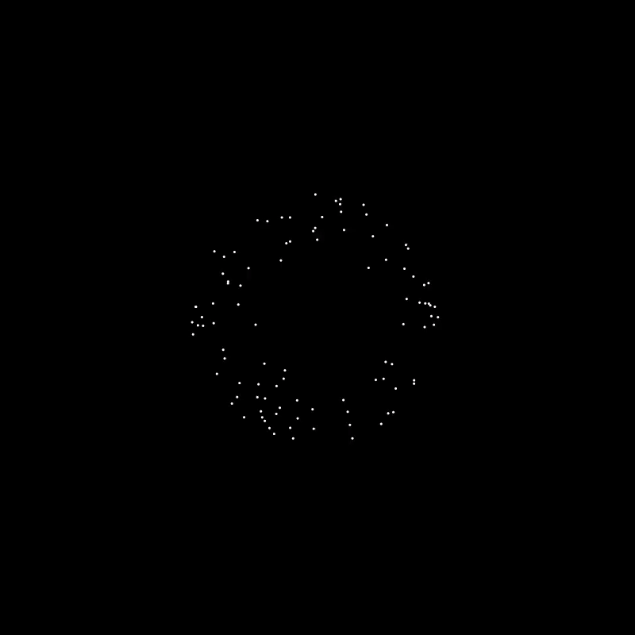

# Barnes-Hut Simulation

## 作业来源
N-body（多体）问题用来描述，给定每个物体当前的位置和速度，预测一群物体在相互引力作用下的运动轨迹。N-body问题最早在牛顿研究木星和其卫星的运动时提出。在天文领域中有广泛应用。

N-body问题的求解算法有很多相关研究，也常常作为并行算法学习的典型案例。朴素的精确算法是计算N个粒子中两两之间（Particle-Particle）的引力，这种方法具有 $$ O(N^2) $$ 的时间复杂度。真实的天体模拟中往往需要模拟数以亿计的粒子，对于这种规模的问题， $$ O(N^2) $$的时间复杂度将使问题不可求解。为此，天文学家创造了很多近似方法用于求解N-body问题，比如基于树的方法（Barnes-Hut algorithm, [Barnes and Hut 1986]()）和粒子网格算法（[Darden et al. 1993]()）等。

在我的笔记本电脑上，示例程序`nbody.py`中的粒子设置到3000以上时，就无法达到60FPS了。想尝试用taichi实现BH算法求解N-body问题，使用近似算法进行加速。实现过程中，发现并不能达到理想的效果，比如每次迭代中构造Quadtree目前只能是串行的，而且使用原生Python递归的遍历树效率较低，可能也还没掌握好Advanced data layout :cry:

示例程序`nbody.py`全部使用field进行初始化、计算非常快。但实现BH算法后，在Quadtree中没有使用taichi scope。整体性能下降较多。为了可以和使用了BH算法的程序`nbody_barnes_hut.py`比较，使用相同的方式重新构造了 $$ O(N^2) $$的计算程序`nbody_naive.py`。相比之下，使用BH算法还是有加速效果的。这样似乎主要用到了taichi的GUI渲染系统 :face_with_head_bandage:

## 运行方式
#### 运行环境
```shell
[Taichi] version 0.8.3, llvm 10.0.0, commit 021af5d2, win, python 3.8.10
```

#### 运行
```shell
$ python nbody_naive.py
$ python nbody_barnes_hut.py
```

## 效果展示
> N = 100
>
> galaxy_size = 0.2

<a href="nbody_naive.gif"></a>

<a href="nbody_barnes_hut.gif"></a>

## 整体结构
```shell
├── LICENSE
├── requirements.txt
├── imgs
│   ├── nbody_quadtree.gif
│   └── nbody_naive.gif
├── body.py	# 粒子类
├── quadtree.py	# Quadtree类
├── nbody_barnes_hut.py	# 使用BH算法的主程序
├── nbody_naive.py	# 使用朴素算法的主程序
└── README.md
```

## 实现细节

### 整体流程

1. 建立2D空间中的四叉树
2. 对每个粒子：遍历四叉树计算合力
3. 更新速度和位置

#### 构造四叉树

对每一个粒子b，依次插入建树，基于以下规则，

1. 如果节点不包含粒子，将粒子b保留在这个节点上。
2. 如果节点是一个内部节点，更新这个节点的质心和总质量。递归地将粒子b插入到合适的象限。
3. 如果节点是一个外部节点，已有一个粒子c。将区域一分为四，将粒子b和c插入到合适的象限。粒子b和c有可能出现在同一个象限，需要继续划分，直到每个区域中最多只有一个粒子。最后，更新质心和总质量。

#### 计算受力

为了计算作用在粒子b上的合力，

1. 如果当前节点是一个外部节点（非粒子b），计算当前节点对粒子b的力，累加。
2. 计算比例s/d，如果s/d小于$$\theta$$，将内部节点作为单独的粒子处理，计算对粒子b的力，累加。
3. 以这样的计算方式递归地处理当前节点的所有孩子节点。

第2步中，比例$$\theta$$的设置非常关键。
$$
\frac{s}{d} < \theta
$$

其中，s是一个节点所代表的正方形区域的边长，d是粒子与结点质心间的距离。$$\theta$$ 默认设置为1。通常 $$\theta$$ 越小，模拟精度越高。当 $$\theta$$ 足够大时，几乎计算了每个粒子对之间的相互作用力，算法退化到 $$O(N^2)$$ 的时间复杂度。当$$\theta$$足够小时，计算受力时的时间复杂度为 $$O(NlogN)$$。

### 数据结构

#### Body

既可表示粒子也可表示具有重量的质点。包含质量、位置、速度、受力信息。

#### Quad

记录正方形区域的左下角坐标以及区域边长。可以返回相应的SW/SE/NW/NE四个区域的Quad类对象。支持GUI绘制正方形框。

#### Quadtree 

通过一个Quad作为root构造树，通过`insert()`建树，通过`apply_force()`计算一个物体受到整个Tree的作用力。
## 参考资料

1. Barnes, J., & Hut, P. (1986). A hierarchical O(N log N) force-calculation algorithm. Nature, 324(6096), 446–449. doi:10.1038/324446a0
2. [battaglia-michael/N-body-Galaxy-Simulation: Simulate an N-body galaxy using a Barnes-Hut recursive tree algorithm (github.com)](https://github.com/battaglia-michael/N-body-Galaxy-Simulation)
3. [yboetz/nbody_bhtree: N-body simulation using a Barnes-Hut tree algorithm (github.com)](https://github.com/yboetz/nbody_bhtree)
4. [Barnes-Hut Algorithm for CS205 (anaroxanapop.github.io)](https://anaroxanapop.github.io/behalf/)
5. [The Barnes-Hut Approximation (jheer.github.io)](https://jheer.github.io/barnes-hut/)
6. [The Barnes-Hut Algorithm (arborjs.org)](http://arborjs.org/docs/barnes-hut)
7. [The Barnes-Hut Galaxy Simulator (beltoforion.de)](https://beltoforion.de/en/barnes-hut-galaxy-simulator/)
8. [Barnes-Hut Simulation, Prof. Viktor Kuncak, LARA – Lab for Automated Reasoning and Analysis - (epfl.ch)](https://lara.epfl.ch/w/parcon18/project4)
